# NetBee 网络链路排查工具设计文档

## 1. 项目概述

NetBee 是一个基于 eBPF 技术实现的网络数据包监控和链路排查工具，能够实时监控 Linux 内核网络栈中的数据包处理过程，提供详细的网络流量分析和故障诊断能力。

## 2. 核心功能

### 2.1 已实现的核心功能

### 2.1.1 核心功能总览表

| 功能模块 | 子功能 | 具体实现 | 技术特点 |
|---------|--------|----------|----------|
| **网络数据包实时监控** | 网络接口监控 | netif_rx 接收监控<br/>dev_queue_xmit 发送监控 | 实时捕获网络接口层数据包 |
| | 协议栈监控 | IPv4 完整监控<br/>实时数据包显示<br/>数据包详细信息 | 支持完整 IPv4 协议栈监控 |
| | 事件驱动处理 | Ring Buffer 通信<br/>异步事件处理<br/>高性能数据传输 | 零拷贝、高性能事件处理 |
| **多协议支持** | TCP 协议 | 连接状态监控<br/>序列号跟踪<br/>确认号跟踪<br/>标志位解析<br/>数据长度计算 | 完整的 TCP 连接状态跟踪 |
| | UDP 协议 | 数据长度监控<br/>端口信息跟踪<br/>基础协议信息 | UDP 协议基础信息提取 |
| | ICMP 协议 | 消息类型监控<br/>ICMP 头部解析<br/>错误消息跟踪 | ICMP 消息类型识别 |
| | 其他协议 | 协议号识别<br/>基础信息提取 | 通用协议支持 |
| **灵活过滤机制** | 协议过滤 | TCP/UDP/ICMP 协议过滤<br/>自定义协议号 | 按协议类型精确过滤 |
| | 主机过滤 | 源 IP 地址过滤<br/>目标 IP 地址过滤<br/>任意 IP 匹配 | 基于 IP 地址的灵活过滤 |
| | 端口过滤 | 源端口过滤<br/>目标端口过滤<br/>任意端口匹配 | 基于端口的精确过滤 |
| | 组合过滤 | 多条件组合<br/>逻辑与/或操作<br/>复杂过滤规则 | 支持复杂过滤条件组合 |
| **Netfilter 钩子监控** | 钩子点监控 | PRE_ROUTING<br/>LOCAL_IN<br/>FORWARD<br/>LOCAL_OUT<br/>POST_ROUTING | 监控所有 Netfilter 钩子点 |
| | 处理结果跟踪 | ACCEPT 结果<br/>DROP 结果<br/>其他处理结果 | 跟踪防火墙处理结果 |
| | 状态管理 | Kprobe 状态存储<br/>Kretprobe 结果获取<br/>状态关联机制 | 完整的状态关联管理 |
| | 防火墙规则验证 | 规则执行监控<br/>处理结果分析 | 防火墙规则验证支持 |
| **调用栈分析** | 调用栈捕获 | kfree_skb 监控<br/>栈深度控制<br/>栈信息提取 | 完整的调用栈信息捕获 |
| | 内核符号解析 | /proc/kallsyms 加载<br/>符号表构建<br/>二分查找算法 | 高效的内核符号解析 |
| | 故障诊断 | 数据包丢弃分析<br/>调用路径跟踪<br/>问题定位支持 | 网络故障诊断支持 |
| | 调试信息 | 函数名显示<br/>偏移量计算<br/>调用关系分析 | 详细的调试信息展示 |
| **MAC 地址厂商识别** | OUI 数据库 | 厂商前缀映射<br/>数据库文件加载<br/>内存缓存机制 | 高效的厂商数据库管理 |
| | 地址解析 | MAC 地址格式化<br/>厂商名称查询<br/>显示格式优化 | 智能的 MAC 地址解析 |
| | 设备识别 | 网络设备分类<br/>厂商信息展示<br/>设备类型识别 | 网络设备智能识别 |
| **网络接口信息** | 接口监控 | 接口索引获取<br/>接口名称转换<br/>接口状态跟踪 | 完整的接口信息监控 |
| | 接口管理 | 动态接口发现<br/>接口信息缓存<br/>接口状态更新 | 智能的接口管理 |
| | 显示优化 | 接口名称显示<br/>索引号回退<br/>异常处理 | 用户友好的接口显示 |
| **用户界面与交互** | 命令行界面 | 参数解析<br/>帮助信息<br/>使用示例 | 完整的命令行支持 |
| | 实时显示 | 表格格式输出<br/>字段对齐<br/>时间戳显示 | 专业的实时显示界面 |
| | 配置管理 | 过滤配置<br/>调试选项<br/>运行时配置 | 灵活的配置管理 |

### 2.1.2 功能层次结构图

```mermaid
graph TD
    A[NetBee 核心功能] --> B[网络数据包实时监控]
    A --> C[多协议支持]
    A --> D[灵活过滤机制]
    A --> E[Netfilter 钩子监控]
    A --> F[调用栈分析]
    A --> G[MAC 地址厂商识别]
    A --> H[网络接口信息]
    A --> I[用户界面与交互]
    
    B --> B1[网络接口监控]
    B --> B2[协议栈监控]
    B --> B3[事件驱动处理]
    
    C --> C1[TCP 协议]
    C --> C2[UDP 协议]
    C --> C3[ICMP 协议]
    C --> C4[其他协议]
    
    D --> D1[协议过滤]
    D --> D2[主机过滤]
    D --> D3[端口过滤]
    D --> D4[组合过滤]
    
    E --> E1[钩子点监控]
    E --> E2[处理结果跟踪]
    E --> E3[状态管理]
    E --> E4[防火墙规则验证]
    
    F --> F1[调用栈捕获]
    F --> F2[内核符号解析]
    F --> F3[故障诊断]
    F --> F4[调试信息]
    
    G --> G1[OUI 数据库]
    G --> G2[地址解析]
    G --> G3[设备识别]
    
    H --> H1[接口监控]
    H --> H2[接口管理]
    H --> H3[显示优化]
    
    I --> I1[命令行界面]
    I --> I2[实时显示]
    I --> I3[配置管理]
    
    style A fill:#e1f5fe
    style B fill:#e8f5e8
    style C fill:#fff3e0
    style D fill:#fce4ec
    style E fill:#f3e5f5
    style F fill:#e0f2f1
    style G fill:#f1f8e9
    style H fill:#fafafa
    style I fill:#f5f5f5
```

### 2.2 功能详细说明

1. **网络数据包实时监控**
   - 监控网络接口接收和发送的数据包
   - 支持 IPv4 协议栈的完整监控
   - 实时显示数据包的详细信息

2. **多协议支持**
   - TCP 协议：支持连接状态、序列号、确认号、标志位等详细信息
   - UDP 协议：支持数据长度等基本信息
   - ICMP 协议：支持 ICMP 消息类型监控

3. **灵活的过滤机制**
   - 协议过滤：支持按 TCP、UDP、ICMP 等协议过滤
   - 主机过滤：支持按源 IP、目标 IP 或任意 IP 过滤
   - 端口过滤：支持按源端口、目标端口或任意端口过滤
   - 组合过滤：支持多种过滤条件的组合使用

4. **Netfilter 钩子监控**
   - 监控 Linux Netfilter 框架的五个钩子点
   - 跟踪数据包在 Netfilter 中的处理结果

5. **调用栈分析**
   - 支持 kfree_skb 调用栈跟踪
   - 内核符号解析，将地址转换为函数名
   - 帮助诊断数据包丢弃原因

6. **MAC 地址厂商识别**
   - 基于 OUI (Organizationally Unique Identifier) 识别网络设备厂商
   - 提供设备厂商信息，便于网络设备识别

7. **网络接口信息**
   - 显示数据包经过的网络接口
   - 支持接口索引到接口名称的转换

### 2.3 功能模块关系图

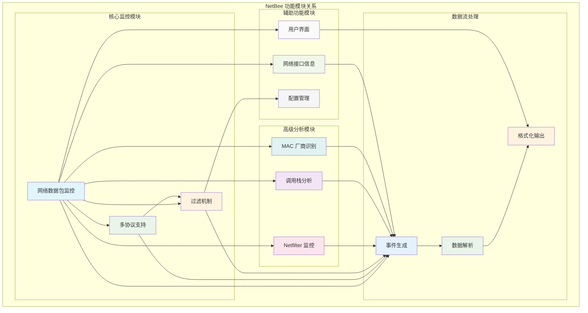

### 2.4 功能实现层次图

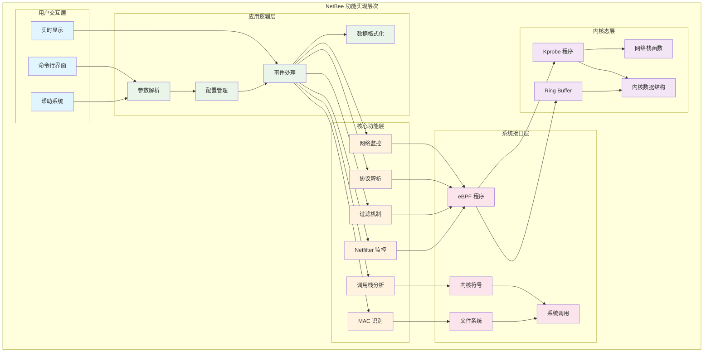

## 3. 整体架构与实现思想

### 3.1 架构设计

NetBee 采用 **用户态 + 内核态** 的混合架构：

```
┌─────────────────────────────────────────────────────────────┐
│                    用户态 (User Space)                      │
├─────────────────────────────────────────────────────────────┤
│  main.go (Go)                                               │
│  ├── 命令行参数解析                                         │
│  ├── eBPF 程序加载和管理                                    │
│  ├── Ring Buffer 数据读取                                   │
│  ├── 事件数据解析和格式化                                    │
│  └── 用户界面显示                                           │
├─────────────────────────────────────────────────────────────┤
│  pkg/core (Go)                                              │
│  ├── 过滤配置管理                                           │
│  ├── 事件数据结构定义                                       │
│  ├── 符号解析器                                             │
│  ├── MAC 地址解析器                                         │
│  └── 协议和网络工具函数                                     │
└─────────────────────────────────────────────────────────────┘
                              │
                              │ eBPF 系统调用
                              │ Ring Buffer
                              │
┌─────────────────────────────────────────────────────────────┐
│                    内核态 (Kernel Space)                    │
├─────────────────────────────────────────────────────────────┤
│  netbee.ebpf.c (eBPF)                                       │
│  ├── Kprobe 程序                                            │
│  │   ├── netif_rx (网络接口接收)                            │
│  │   ├── ip_rcv (IP 层接收)                                │
│  │   ├── ip_local_deliver (本地投递)                        │
│  │   ├── dev_queue_xmit (设备队列发送)                      │
│  │   ├── tcp_v4_rcv (TCP 接收)                             │
│  │   ├── udp_rcv (UDP 接收)                                │
│  │   ├── icmp_rcv (ICMP 接收)                              │
│  │   ├── tcp_transmit_skb (TCP 发送)                       │
│  │   ├── ip_queue_xmit (IP 队列发送)                       │
│  │   └── kfree_skb (内存释放)                              │
│  ├── Kretprobe 程序                                         │
│  │   └── nf_hook_slow_ret (Netfilter 返回)                 │
│  ├── 数据包解析和过滤                                        │
│  ├── 事件数据收集                                           │
│  └── Ring Buffer 数据提交                                   │
└─────────────────────────────────────────────────────────────┘
```

### 3.2 实现思想

#### 3.2.1 基于 eBPF 的内核监控

**核心思想**：利用 eBPF 技术在内核态直接监控网络数据包处理过程，避免用户态和内核态之间的频繁数据拷贝，实现高性能的网络监控。

**技术优势**：
- **零拷贝**：数据包在内核态直接处理，无需拷贝到用户态
- **高性能**：eBPF 程序在内核态运行，延迟极低
- **安全性**：eBPF 程序经过验证器检查，确保内核安全
- **灵活性**：支持动态加载和卸载监控程序

#### 3.2.2 事件驱动架构

**设计理念**：采用事件驱动的方式处理网络数据包，每个数据包经过内核网络栈时都会触发相应的事件，通过 Ring Buffer 将事件数据传递给用户态程序。

**事件类型**：
- **接收事件**：数据包从网络接口接收
- **路由事件**：数据包在 IP 层的路由处理
- **传输事件**：数据包在传输层的处理
- **发送事件**：数据包向网络接口发送
- **释放事件**：数据包内存释放

##### 3.2.2.1 事件驱动架构模块图

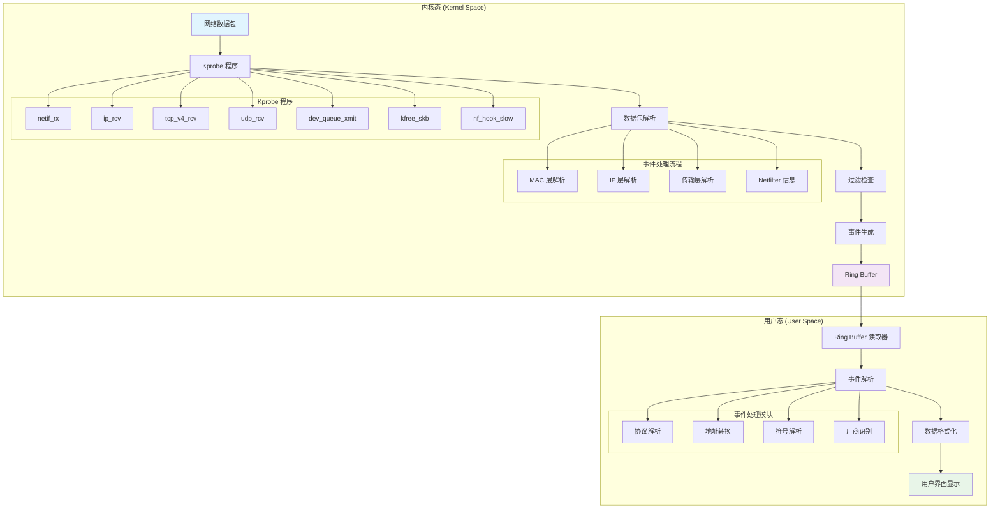

##### 3.2.2.2 事件处理流程图

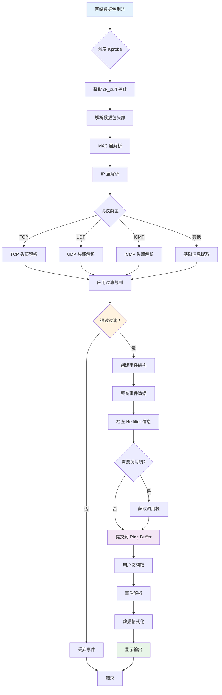

##### 3.2.2.3 事件类型与处理流程

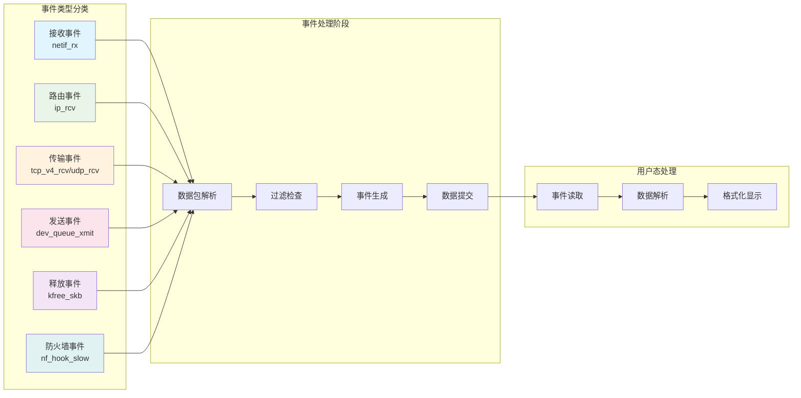

##### 3.2.2.4 Ring Buffer 通信机制

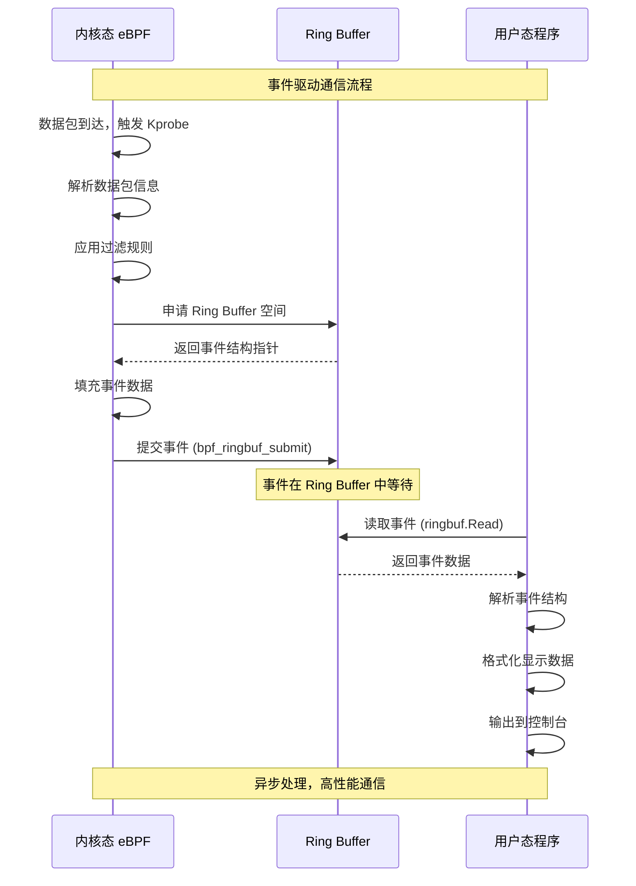

#### 3.2.3 分层监控策略

**监控层次**：
1. **网络接口层**：监控 `netif_rx` 和 `dev_queue_xmit`
2. **IP 层**：监控 `ip_rcv`、`ip_local_deliver`、`ip_queue_xmit`
3. **传输层**：监控 `tcp_v4_rcv`、`udp_rcv`、`icmp_rcv`、`tcp_transmit_skb`
4. **Netfilter 层**：监控 `nf_hook_slow` 和其返回值
5. **内存管理**：监控 `kfree_skb` 调用栈

##### 3.2.3.1 网络栈分层监控图

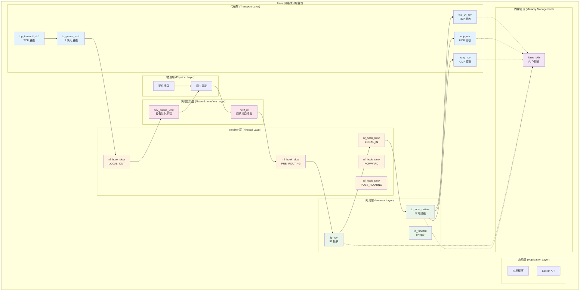

##### 3.2.3.2 监控点与数据包流向

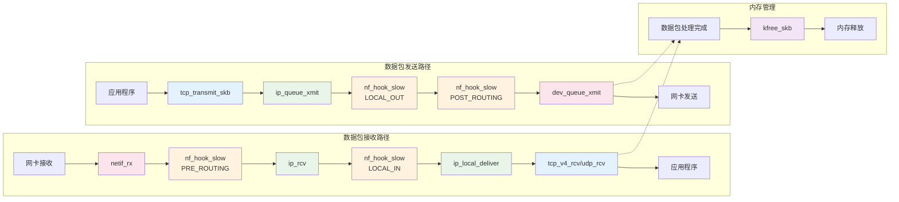

##### 3.2.3.3 监控策略配置

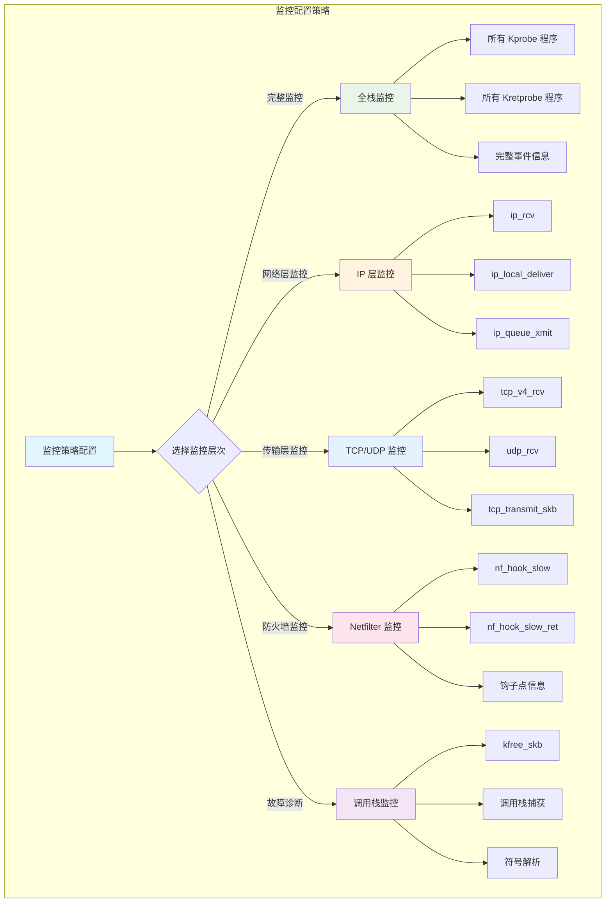

## 4. 核心功能详细实现

### 4.1 网络数据包监控实现

#### 4.1.1 eBPF 程序结构

```c
// 网络数据包事件结构
struct so_event {
    __u32 src_addr;        // 源 IP 地址
    __u32 dst_addr;        // 目标 IP 地址
    __u32 ip_proto;        // IP 协议号
    __u8 src_mac[6];       // 源 MAC 地址
    __u8 dst_mac[6];       // 目标 MAC 地址
    __u8 ttl;              // TTL 值
    __u32 ifindex;         // 网络接口索引
    __u16 src_port;        // 源端口
    __u16 dst_port;        // 目标端口
    // TCP 相关字段
    __u8 tcp_flags;        // TCP 标志位
    __u32 tcp_seq;         // TCP 序列号
    __u32 tcp_ack;         // TCP 确认号
    __u16 tcp_len;         // TCP 数据长度
    // UDP 相关字段
    __u16 udp_len;         // UDP 数据长度
    char func_name[32];    // 函数名
    __u32 pid;             // 进程 ID
    __u64 stack_trace[64]; // 调用栈信息
    __u32 stack_depth;     // 调用栈深度
    // Netfilter 相关字段
    __u8 nf_hook;          // Netfilter 钩子点
    __s8 verdict;          // 处理结果
};
```

#### 4.1.2 数据包解析流程

```c
static int do_trace_skb(struct pt_regs *ctx, struct sk_buff *skb, const char *func_name) {
    // 1. 获取网络接口信息
    struct net_device *dev = BPF_CORE_READ(skb, dev);
    __u32 ifindex = BPF_CORE_READ(dev, ifindex);
    
    // 2. 读取数据包头部偏移
    __u16 nhoff = BPF_CORE_READ(skb, network_header);  // IP 头部偏移
    __u16 mhoff = BPF_CORE_READ(skb, mac_header);      // MAC 头部偏移
    unsigned char *head = BPF_CORE_READ(skb, head);    // 数据包头部指针
    
    // 3. 解析以太网头部
    void *eth_ptr = (void *)(head + mhoff);
    struct ethhdr eth;
    bpf_probe_read_kernel(&eth, sizeof(eth), eth_ptr);
    
    // 4. 解析 IP 头部
    void *iph_ptr = (void *)(head + nhoff);
    struct iphdr iph;
    bpf_probe_read_kernel(&iph, sizeof(iph), iph_ptr);
    
    // 5. 解析传输层头部（TCP/UDP）
    if (iph.protocol == IPPROTO_TCP || iph.protocol == IPPROTO_UDP) {
        __u8 ihl = iph.ihl;
        __u32 transport_offset = nhoff + (ihl * 4);
        void *transport_ptr = (void *)(head + transport_offset);
        
        // 读取端口信息
        __u32 ports;
        bpf_probe_read_kernel(&ports, sizeof(ports), transport_ptr);
        src_port = bpf_ntohs((__u16)(ports >> 16));
        dst_port = bpf_ntohs((__u16)(ports & 0xFFFF));
        
        // 解析 TCP 头部详细信息
        if (iph.protocol == IPPROTO_TCP) {
            struct tcphdr tcp_hdr;
            bpf_probe_read_kernel(&tcp_hdr, sizeof(tcp_hdr), transport_ptr);
            tcp_flags = tcp_hdr.fin | (tcp_hdr.syn << 1) | ...;
            tcp_seq = bpf_ntohl(tcp_hdr.seq);
            tcp_ack = bpf_ntohl(tcp_hdr.ack_seq);
        }
    }
    
    // 6. 应用过滤条件
    if (!apply_filters(&iph, src_port, dst_port)) {
        return -1; // 被过滤掉
    }
    
    // 7. 创建事件并提交到 Ring Buffer
    struct so_event *e = bpf_ringbuf_reserve(&rb, sizeof(*e), 0);
    // ... 填充事件数据 ...
    bpf_ringbuf_submit(e, 0);
    
    return 1;
}
```

### 4.2 过滤机制实现

#### 4.2.1 过滤机制架构图

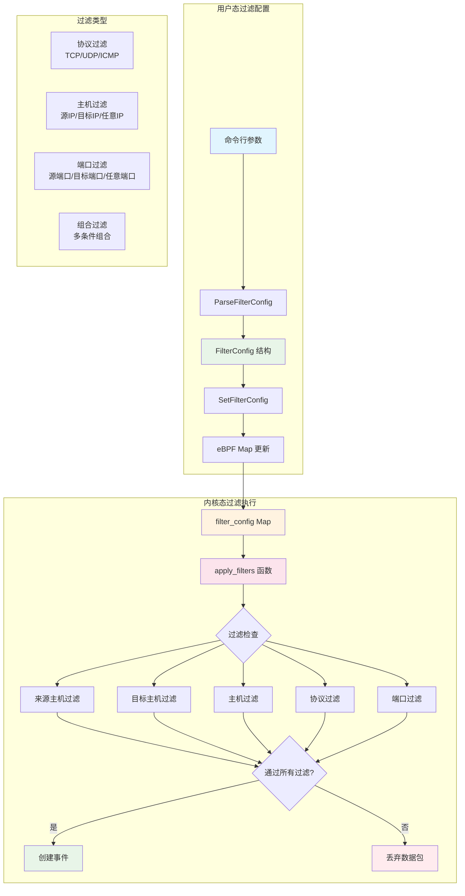

#### 4.2.2 过滤配置管理

**用户态配置**：
```go
type FilterConfig struct {
    SrcHostStr   string    // 源主机字符串
    SrcHost      uint32    // 源主机 IP（网络字节序）
    DstHostStr   string    // 目标主机字符串
    DstHost      uint32    // 目标主机 IP（网络字节序）
    HostStr      string    // 主机字符串
    Host         uint32    // 主机 IP（网络字节序）
    Protocols    []string  // 协议字符串列表
    ProtocolNums []uint32  // 协议号列表
    DstPort      uint16    // 目标端口
    SrcPort      uint16    // 源端口
    Port         uint16    // 端口（源或目标）
}
```

**内核态过滤**：
```c
// 过滤配置 map
struct {
    __uint(type, BPF_MAP_TYPE_ARRAY);
    __type(key, __u32);
    __type(value, __u32);
    __uint(max_entries, 10);
} filter_config SEC(".maps");

static int apply_filters(struct iphdr *iph, __u16 src_port, __u16 dst_port) {
    __u32 saddr = bpf_ntohl(iph->saddr);
    __u32 daddr = bpf_ntohl(iph->daddr);
    
    // 来源主机过滤
    __u32 src_host_key = 0;
    __u32 *src_host_filter = bpf_map_lookup_elem(&filter_config, &src_host_key);
    if (src_host_filter && *src_host_filter != 0) {
        if (saddr != *src_host_filter) {
            return 0; // 过滤掉
        }
    }
    
    // 目标主机过滤
    __u32 dst_host_key = 5;
    __u32 *dst_host_filter = bpf_map_lookup_elem(&filter_config, &dst_host_key);
    if (dst_host_filter && *dst_host_filter != 0) {
        if (daddr != *dst_host_filter) {
            return 0; // 过滤掉
        }
    }
    
    // 协议过滤
    __u32 proto_key = 1;
    __u32 *proto_allowed = bpf_map_lookup_elem(&filter_config, &proto_key);
    if (proto_allowed && *proto_allowed != 0) {
        if (iph->protocol != *proto_allowed) {
            return 0; // 过滤掉
        }
    }
    
    // 端口过滤
    __u32 port_key = 4;
    __u32 *port_allowed = bpf_map_lookup_elem(&filter_config, &port_key);
    if (port_allowed && *port_allowed != 0) {
        if (src_port != *port_allowed && dst_port != *port_allowed) {
            return 0; // 过滤掉
        }
    }
    
    return 1; // 通过过滤
}
```

#### 4.2.2 过滤配置传递

**用户态到内核态**：
```go
func SetFilterConfig(coll *ebpf.Collection, config *FilterConfig, kfreeEnabled bool) error {
    filterMap := coll.Maps["filter_config"]
    
    // 设置来源主机过滤
    if config.SrcHost != 0 {
        key := uint32(0)
        filterMap.Put(key, config.SrcHost)
    }
    
    // 设置目标主机过滤
    if config.DstHost != 0 {
        key := uint32(5)
        filterMap.Put(key, config.DstHost)
    }
    
    // 设置协议过滤
    if len(config.ProtocolNums) > 0 {
        key := uint32(1)
        filterMap.Put(key, config.ProtocolNums[0])
    }
    
    // 设置端口过滤
    if config.Port != 0 {
        key := uint32(4)
        filterMap.Put(key, uint32(config.Port))
    }
    
    return nil
}
```

### 4.3 Netfilter 钩子监控实现

#### 4.3.1 Netfilter 监控架构图

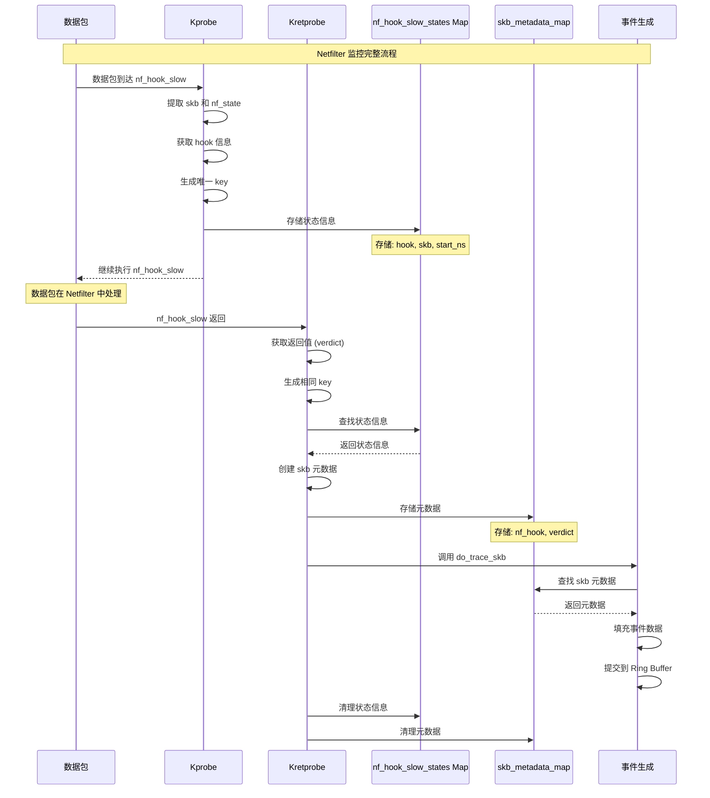

#### 4.3.2 Netfilter 钩子点

Linux Netfilter 框架提供五个钩子点：

```c
// Netfilter 钩子点定义
#define NF_INET_PRE_ROUTING    0  // 路由前处理
#define NF_INET_LOCAL_IN       1  // 本地输入
#define NF_INET_FORWARD        2  // 转发
#define NF_INET_LOCAL_OUT      3  // 本地输出
#define NF_INET_POST_ROUTING   4  // 路由后处理
```

#### 4.3.2 钩子监控实现

**Kprobe 监控**：
```c
SEC("kprobe/nf_hook_slow")
int handle_nf_hook_slow(struct pt_regs *ctx) {
    // 获取函数参数
    struct sk_buff *skb = (struct sk_buff *)PT_REGS_PARM1(ctx);
    struct nf_hook_state *nf_state = (struct nf_hook_state *)PT_REGS_PARM2(ctx);
    
    // 获取钩子点信息
    unsigned int hook = BPF_CORE_READ(nf_state, hook);
    
    // 生成唯一键值
    __u32 key = generate_nf_hook_key();
    
    // 存储状态信息
    struct nf_hook_slow_state state;
    state.hook = hook;
    state.skb = skb;
    state.start_ns = bpf_ktime_get_ns();
    
    bpf_map_update_elem(&nf_hook_slow_states, &key, &state, BPF_ANY);
    
    return 0;
}
```

**Kretprobe 监控**：
```c
SEC("kretprobe/nf_hook_slow")
int handle_nf_hook_slow_ret(struct pt_regs *ctx) {
    // 获取函数返回值（verdict）
    __s64 rc_signed = (__s64)PT_REGS_RC(ctx);
    int verdict = (int)rc_signed;
    
    // 生成相同的键值
    __u32 key = generate_nf_hook_key();
    
    // 查找对应的状态
    struct nf_hook_slow_state *state = bpf_map_lookup_elem(&nf_hook_slow_states, &key);
    if (!state) {
        return 0;
    }
    
    // 设置 skb 元数据
    struct skb_metadata metadata = {
        .nf_hook = state->hook,
        .verdict = verdict
    };
    
    // 存储元数据
    bpf_map_update_elem(&skb_metadata_map, &key, &metadata, BPF_ANY);
    
    // 调用数据包跟踪
    do_trace_skb(ctx, state->skb, "nf_hook_slow");
    
    // 清理状态
    bpf_map_delete_elem(&nf_hook_slow_states, &key);
    
    return 0;
}
```

#### 4.3.3 状态管理

**状态存储结构**：
```c
// nf_hook_slow 中间状态结构体
struct nf_hook_slow_state {
    unsigned int hook;           // 钩子点
    struct sk_buff *skb;         // 数据包指针
    __u64 start_ns;             // 开始时间戳
};

// skb 元数据结构体
struct skb_metadata {
    __u8 nf_hook;               // Netfilter 钩子点
    __s8 verdict;               // Netfilter 处理结果
};
```

**状态哈希表**：
```c
// nf_hook_slow 状态哈希表
struct {
    __uint(type, BPF_MAP_TYPE_HASH);
    __type(key, __u32);
    __type(value, struct nf_hook_slow_state);
    __uint(max_entries, 512);
} nf_hook_slow_states SEC(".maps");

// skb 元数据哈希表
struct {
    __uint(type, BPF_MAP_TYPE_HASH);
    __type(key, __u32);
    __type(value, struct skb_metadata);
    __uint(max_entries, 1024);
} skb_metadata_map SEC(".maps");
```

### 4.4 调用栈分析实现

#### 4.4.1 调用栈分析架构图

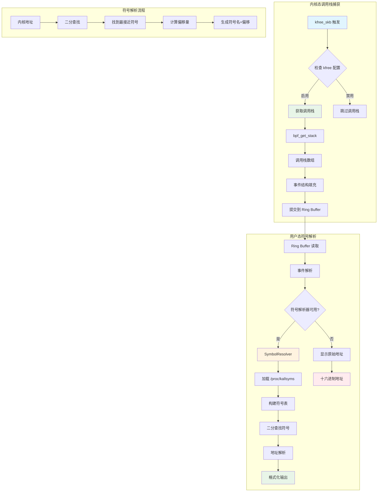

#### 4.4.2 调用栈捕获

**eBPF 端**：
```c
// 检查是否需要获取 kfree 调用栈信息
__u32 kfree_key = 0;
__u32 *kfree_enabled = bpf_map_lookup_elem(&kfree_config, &kfree_key);

if (kfree_enabled && *kfree_enabled) {
    // 检查是否是 kfree_skb 函数调用
    if (func_name[0] == 'k' && func_name[1] == 'f' && 
        func_name[2] == 'r' && func_name[3] == 'e' && 
        func_name[4] == 'e') {
        
        // 获取调用栈信息
        e->stack_depth = bpf_get_stack(ctx, e->stack_trace, sizeof(e->stack_trace), 0);
        if (e->stack_depth < 0) {
            e->stack_depth = 0;
        }
    }
}
```

#### 4.4.2 符号解析

**内核符号加载**：
```go
type SymbolResolver struct {
    symbols []KernelSymbol
}

type KernelSymbol struct {
    Address uint64
    Type    string
    Name    string
}

func (sr *SymbolResolver) loadKernelSymbols() error {
    file, err := os.Open("/proc/kallsyms")
    if err != nil {
        return err
    }
    defer file.Close()
    
    scanner := bufio.NewScanner(file)
    for scanner.Scan() {
        line := strings.TrimSpace(scanner.Text())
        parts := strings.Fields(line)
        
        if len(parts) < 3 {
            continue
        }
        
        // 解析地址
        address, err := strconv.ParseUint(parts[0], 16, 64)
        if err != nil {
            continue
        }
        
        // 只包含文本符号（函数）
        symbolType := parts[1]
        if symbolType == "t" || symbolType == "T" {
            sr.symbols = append(sr.symbols, KernelSymbol{
                Address: address,
                Type:    symbolType,
                Name:    parts[2],
            })
        }
    }
    
    // 按地址排序，便于二分查找
    sort.Slice(sr.symbols, func(i, j int) bool {
        return sr.symbols[i].Address < sr.symbols[j].Address
    })
    
    return nil
}
```

**地址解析**：
```go
func (sr *SymbolResolver) ResolveAddress(address uint64) string {
    if len(sr.symbols) == 0 {
        return fmt.Sprintf("0x%x", address)
    }
    
    // 二分查找最接近的符号
    left, right := 0, len(sr.symbols)-1
    var bestMatch *KernelSymbol
    
    for left <= right {
        mid := (left + right) / 2
        symbol := &sr.symbols[mid]
        
        if symbol.Address <= address {
            bestMatch = symbol
            left = mid + 1
        } else {
            right = mid - 1
        }
    }
    
    if bestMatch != nil {
        offset := address - bestMatch.Address
        if offset == 0 {
            return bestMatch.Name
        }
        return fmt.Sprintf("%s+0x%x", bestMatch.Name, offset)
    }
    
    return fmt.Sprintf("0x%x", address)
}
```

### 4.5 MAC 地址厂商识别实现

#### 4.5.1 厂商数据库

**数据格式**：
```
00:18:82	HuaweiTechno
00:1B:21	Intel Corporate
00:1C:42	Apple, Inc.
00:1D:7E	Apple, Inc.
...
```

**解析器实现**：
```go
type MacResolver struct {
    vendorMap map[string]string // MAC prefix -> vendor name mapping
    mutex     sync.RWMutex      // 读写锁保证线程安全
}

func (mr *MacResolver) loadManufFile() error {
    // 尝试多个可能的路径
    possiblePaths := []string{
        "./target/manuf.txt",
        "target/manuf.txt",
        "./manuf.txt",
        "manuf.txt",
    }
    
    var manufPath string
    for _, path := range possiblePaths {
        if _, err := os.Stat(path); err == nil {
            manufPath = path
            break
        }
    }
    
    file, err := os.Open(manufPath)
    if err != nil {
        return err
    }
    defer file.Close()
    
    scanner := bufio.NewScanner(file)
    for scanner.Scan() {
        line := strings.TrimSpace(scanner.Text())
        if line == "" || strings.HasPrefix(line, "#") {
            continue
        }
        
        parts := strings.Split(line, "\t")
        if len(parts) < 2 {
            continue
        }
        
        macPrefix := strings.TrimSpace(parts[0])
        vendorName := strings.TrimSpace(parts[1])
        
        if isValidMacPrefix(macPrefix) {
            mr.vendorMap[strings.ToUpper(macPrefix)] = vendorName
        }
    }
    
    return nil
}
```

#### 4.5.2 MAC 地址解析

```go
func (mr *MacResolver) ResolveMacAddress(mac [6]uint8) string {
    mr.mutex.RLock()
    defer mr.mutex.RUnlock()
    
    // 转换 MAC 地址为字符串格式
    macStr := MacToString(mac)
    
    // 提取前 3 个八位组（OUI）
    parts := strings.Split(macStr, ":")
    if len(parts) < 3 {
        return macStr
    }
    
    oui := strings.ToUpper(strings.Join(parts[:3], ":"))
    
    // 查找厂商名称
    if vendor, exists := mr.vendorMap[oui]; exists {
        return fmt.Sprintf("%s(%s)", macStr, vendor)
    }
    
    return macStr
}
```

### 4.6 事件数据处理实现

#### 4.6.1 Ring Buffer 通信

**eBPF 端提交**：
```c
// 网络数据包事件的 ring buffer
struct {
    __uint(type, BPF_MAP_TYPE_RINGBUF);
    __uint(max_entries, 256 * 1024);
} rb SEC(".maps");

// 提交事件到 Ring Buffer
struct so_event *e = bpf_ringbuf_reserve(&rb, sizeof(*e), 0);
if (!e) {
    return 0; // 内存不足
}

// 填充事件数据
e->ip_proto = (__u32)iph.protocol;
e->src_addr = saddr;
e->dst_addr = daddr;
// ... 填充其他字段 ...

bpf_ringbuf_submit(e, 0);
```

**用户态读取**：
```go
// 创建 Ring Buffer 读取器
rb, err := ringbuf.NewReader(coll.Maps["rb"])
if err != nil {
    log.Fatal("Failed to create ring buffer reader:", err)
}
defer rb.Close()

// 读取事件数据
for {
    record, err := rb.Read()
    if err != nil {
        if errors.Is(err, ringbuf.ErrClosed) {
            return
        }
        log.Printf("Error reading from ring buffer: %v", err)
        continue
    }
    
    // 解析事件数据
    var event core.SoEvent
    if len(record.RawSample) < int(unsafe.Sizeof(event)) {
        continue
    }
    
    event = *(*core.SoEvent)(unsafe.Pointer(&record.RawSample[0]))
    
    // 处理事件
    processEvent(&event)
}
```

#### 4.6.2 事件格式化

```go
func (e *SoEvent) FormatEventInfo(symbolResolver *SymbolResolver) string {
    // 获取调用栈信息
    stackInfo := FormatStackTrace(e.StackTrace, e.StackDepth, symbolResolver)
    
    // 检查是否有 Netfilter 信息
    var nfInfo string
    if e.NFHook != 0 || e.Verdict != 0 {
        nfInfo = " NF:" + FormatNFInfo(e.NFHook, e.Verdict)
    }
    
    // 获取接口名称
    ifaceName := IfIndexToName(e.IfIndex)
    
    // 获取函数名
    funcName := string(e.FuncName[:])
    funcName = strings.TrimRight(funcName, "\x00")
    
    if e.IPProto == ProtocolTCP {
        tcpFlags := GetTcpFlagsString(e.TcpFlags)
        return fmt.Sprintf("%d->%d %s Seq:%d Ack:%d %s [%s] PID:%d%s%s", 
            e.SrcPort, e.DstPort, tcpFlags, e.TcpSeq, e.TcpAck, 
            ifaceName, funcName, e.Pid, stackInfo, nfInfo)
    } else if e.IPProto == ProtocolUDP {
        return fmt.Sprintf("%d->%d %s [%s] PID:%d%s%s", 
            e.SrcPort, e.DstPort, ifaceName, funcName, e.Pid, stackInfo, nfInfo)
    } else {
        protocol := GetProtocolName(e.IPProto)
        return fmt.Sprintf("%s %s [%s] PID:%d%s%s", 
            protocol, ifaceName, funcName, e.Pid, stackInfo, nfInfo)
    }
}
```

## 5. 技术特点与优势

### 5.1 性能优势

1. **零拷贝技术**：数据包在内核态直接处理，避免用户态和内核态之间的数据拷贝
2. **事件驱动**：基于事件驱动架构，响应速度快
3. **高效过滤**：在内核态进行过滤，减少无效数据的传输
4. **异步处理**：使用 Ring Buffer 实现异步数据传输

### 5.2 功能优势

1. **全面监控**：覆盖网络栈的各个层次，提供完整的网络流量视图
2. **灵活过滤**：支持多种过滤条件，满足不同场景的需求
3. **详细分析**：提供协议详细信息、调用栈分析、厂商识别等高级功能
4. **实时监控**：实时显示网络流量，便于故障诊断

### 5.3 技术优势

1. **内核集成**：基于 eBPF 技术，与内核深度集成
2. **安全可靠**：eBPF 程序经过验证器检查，确保内核安全
3. **动态加载**：支持动态加载和卸载，不影响系统运行
4. **跨平台**：基于 CO-RE 技术，支持不同内核版本

## 6. 使用场景

### 6.1 网络故障诊断

- **连接问题**：监控 TCP 连接建立和断开过程
- **丢包分析**：通过 kfree_skb 调用栈分析丢包原因
- **路由问题**：监控数据包在 Netfilter 中的处理过程

### 6.2 网络安全监控

- **异常流量检测**：监控异常的网络连接和数据传输
- **防火墙规则验证**：验证 Netfilter 规则的正确性
- **入侵检测**：监控可疑的网络活动

### 6.3 性能分析

- **网络延迟分析**：分析数据包在网络栈中的处理时间
- **吞吐量监控**：监控网络接口的流量统计
- **协议分析**：分析不同协议的网络行为

### 6.4 开发调试

- **网络程序调试**：调试网络应用程序的数据包处理
- **内核模块开发**：调试网络相关的内核模块
- **协议实现验证**：验证网络协议实现的正确性

## 7. 总结

NetBee 是一个功能强大、性能优异的网络链路排查工具，基于 eBPF 技术实现了对 Linux 内核网络栈的全面监控。通过分层监控策略、灵活的过滤机制、详细的协议分析和调用栈跟踪，为网络故障诊断、安全监控和性能分析提供了强有力的支持。

该工具的设计充分体现了现代网络监控工具的发展趋势：内核态处理、事件驱动、实时分析。其架构设计合理，实现技术先进，为网络运维人员提供了一个高效、可靠的网络诊断工具。
