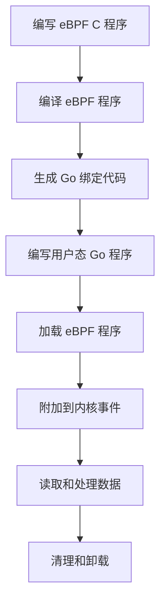
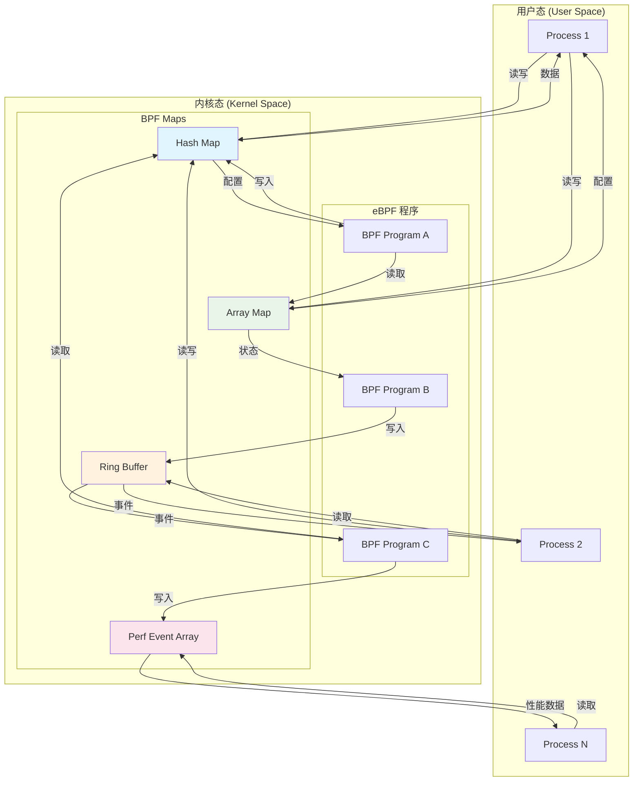
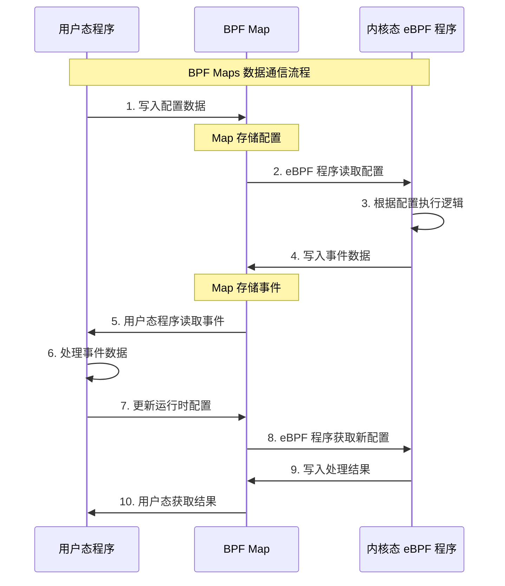
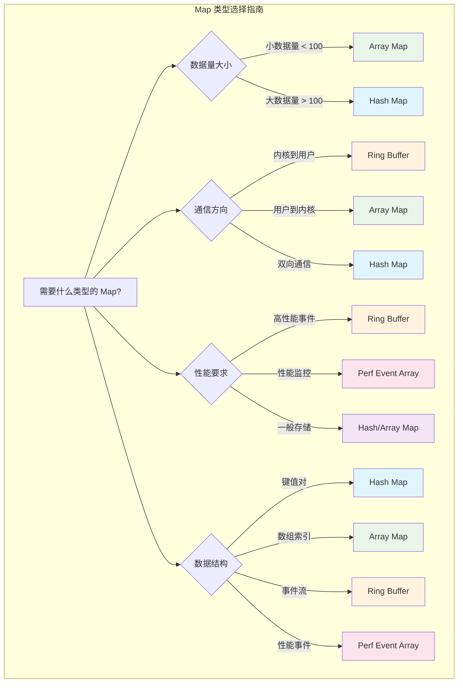
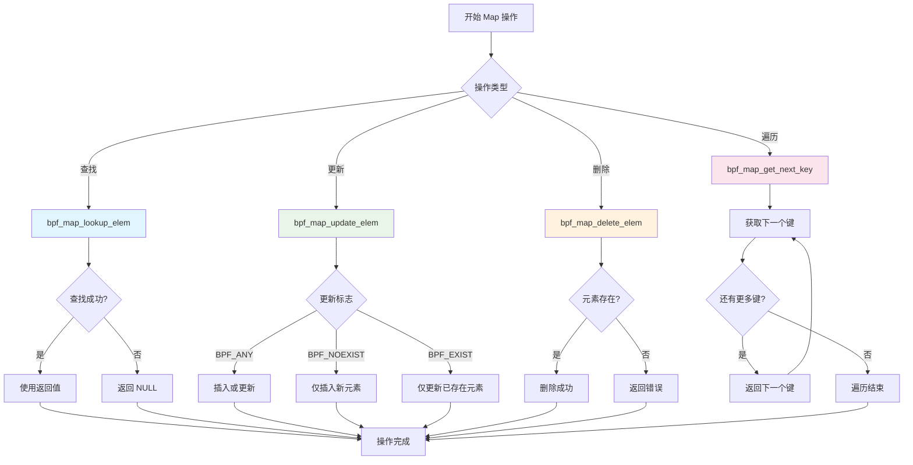
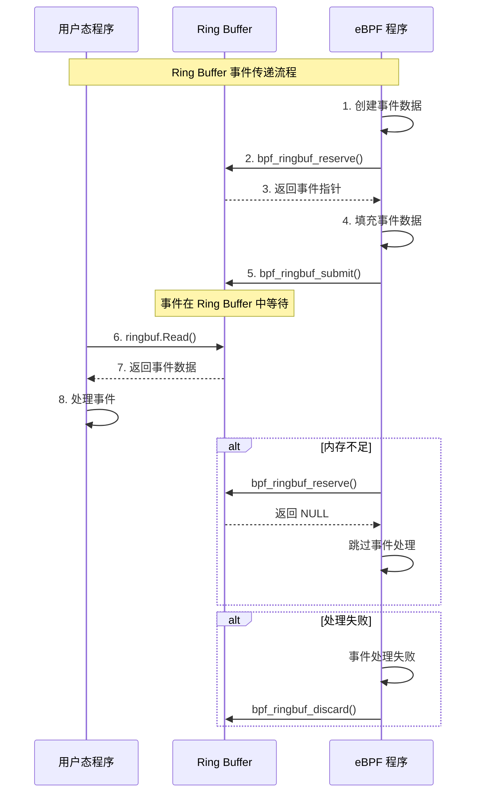
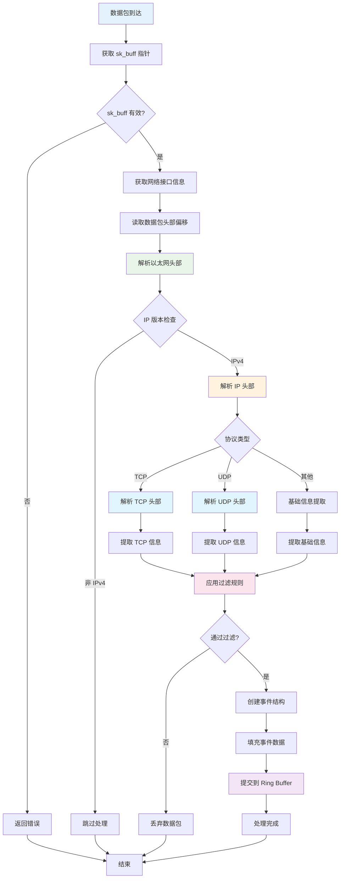
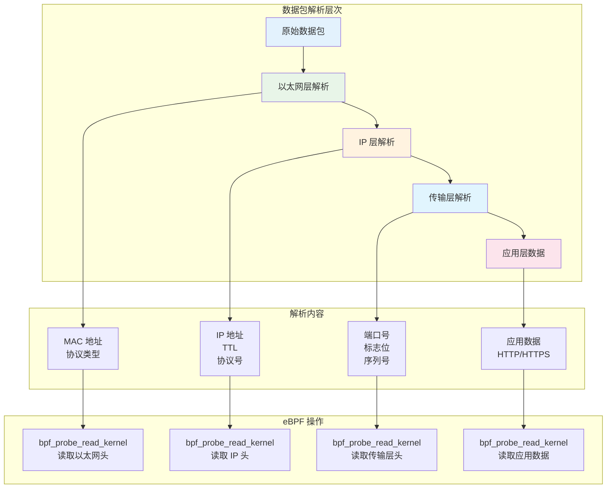
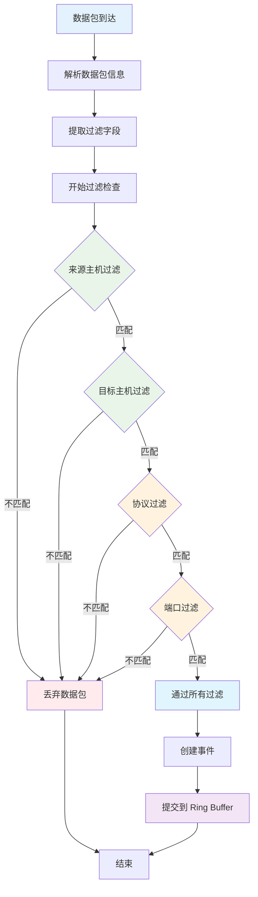
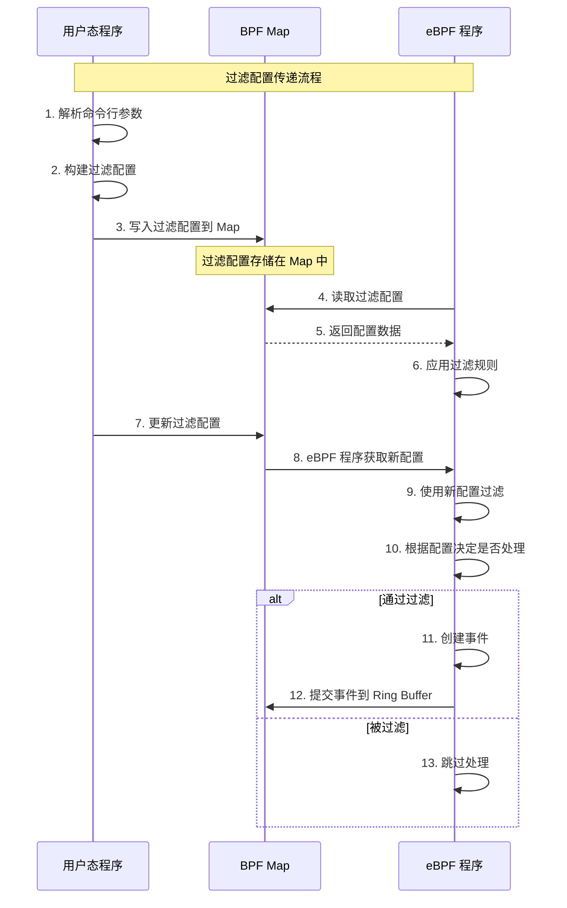

# eBPF 开发入门指南

## 1. eBPF 概述

### 1.1 什么是 eBPF

eBPF（Extended Berkeley Packet Filter）是 Linux 内核中的一个革命性技术，它允许用户态程序在内核态安全地运行代码，而无需修改内核源码或加载内核模块。eBPF 最初用于网络包过滤，现在已经扩展到系统调用跟踪、性能监控、安全监控等多个领域。

### 1.2 eBPF 的优势

- **安全性**：eBPF 程序经过验证器检查，确保不会导致内核崩溃
- **高性能**：在内核态运行，避免了用户态和内核态之间的频繁切换
- **灵活性**：支持动态加载和卸载，无需重启系统
- **可观测性**：提供丰富的系统监控和调试能力

### 1.3 eBPF 应用场景

- **网络监控**：数据包过滤、流量分析、网络性能监控
- **系统监控**：系统调用跟踪、性能分析、资源监控
- **安全监控**：异常检测、访问控制、安全审计
- **故障诊断**：调用栈分析、性能瓶颈定位

## 2. eBPF 开发环境搭建

### 2.1 系统要求

```bash
# 检查内核版本（需要 4.18+）
uname -r

# 检查 eBPF 支持
ls /sys/fs/bpf/

# 检查 BTF 支持
ls /sys/kernel/btf/
```

### 2.2 开发工具安装

```bash
# Ubuntu/Debian
sudo apt update
sudo apt install -y \
    build-essential \
    clang \
    llvm \
    libbpf-dev \
    linux-headers-$(uname -r) \
    pkg-config

# CentOS/RHEL
sudo yum groupinstall -y "Development Tools"
sudo yum install -y \
    clang \
    llvm \
    kernel-devel \
    kernel-headers

# 安装 Go 和 eBPF 相关库
go mod init ebpf-project
go get github.com/cilium/ebpf
go get github.com/cilium/ebpf/link
go get github.com/cilium/ebpf/ringbuf
```

### 2.3 项目结构

```
ebpf-project/
├── cmd/
│   └── main.go              # 用户态程序
├── ebpf/
│   └── program.bpf.c        # eBPF 内核态程序
├── target/
│   ├── program.o            # 编译后的 eBPF 对象文件
│   └── program.go           # 生成的 Go 绑定代码
├── go.mod
├── go.sum
└── Makefile
```

## 3. eBPF 程序类型

### 3.1 网络相关程序类型

#### 3.1.1 Kprobe/Kretprobe

用于监控内核函数调用：

```c
// 监控网络接口接收函数
SEC("kprobe/netif_rx")
int handle_netif_rx(struct pt_regs *ctx) {
    struct sk_buff *skb = (struct sk_buff *)PT_REGS_PARM1(ctx);
    // 处理逻辑
    return 0;
}

// 监控函数返回
SEC("kretprobe/netif_rx")
int handle_netif_rx_ret(struct pt_regs *ctx) {
    int ret = PT_REGS_RC(ctx);
    // 处理返回值
    return 0;
}
```

#### 3.1.2 Socket Filter

用于过滤网络数据包：

```c
SEC("socket")
int socket_filter(struct __sk_buff *skb) {
    // 数据包过滤逻辑
    return 0; // 0=丢弃, 1=通过
}
```

#### 3.1.3 XDP

用于高性能网络包处理：

```c
SEC("xdp")
int xdp_prog(struct xdp_md *ctx) {
    // 数据包处理逻辑
    return XDP_PASS; // XDP_PASS, XDP_DROP, XDP_REDIRECT
}
```

### 3.2 系统监控程序类型

#### 3.2.1 Tracepoint

用于监控系统事件：

```c
SEC("tracepoint/syscalls/sys_enter_execve")
int trace_execve(struct trace_event_raw_sys_enter *ctx) {
    // 监控 execve 系统调用
    return 0;
}
```

#### 3.2.2 Uprobe/Uretprobe

用于监控用户态函数：

```c
SEC("uprobe")
int uprobe_handler(struct pt_regs *ctx) {
    // 监控用户态函数调用
    return 0;
}
```

## 4. eBPF 开发流程

### 4.1 开发流程概览



### 4.2 详细开发步骤

#### 步骤 1：编写 eBPF C 程序

```c
// ebpf/network_monitor.bpf.c
#include "vmlinux.h"
#include <bpf/bpf_helpers.h>
#include <bpf/bpf_endian.h>

// 定义事件结构
struct network_event {
    __u32 src_ip;
    __u32 dst_ip;
    __u16 src_port;
    __u16 dst_port;
    __u8 protocol;
    __u64 timestamp;
};

// 定义 Ring Buffer
struct {
    __uint(type, BPF_MAP_TYPE_RINGBUF);
    __uint(max_entries, 256 * 1024);
} events SEC(".maps");

// 定义过滤配置
struct {
    __uint(type, BPF_MAP_TYPE_ARRAY);
    __type(key, __u32);
    __type(value, __u32);
    __uint(max_entries, 10);
} filter_config SEC(".maps");

// Kprobe 程序
SEC("kprobe/tcp_v4_rcv")
int handle_tcp_rcv(struct pt_regs *ctx) {
    struct sk_buff *skb = (struct sk_buff *)PT_REGS_PARM1(ctx);
    
    // 分配事件结构
    struct network_event *event;
    event = bpf_ringbuf_reserve(&events, sizeof(*event), 0);
    if (!event) {
        return 0;
    }
    
    // 填充事件数据
    event->timestamp = bpf_ktime_get_ns();
    // ... 其他字段填充
    
    // 提交事件
    bpf_ringbuf_submit(event, 0);
    
    return 0;
}

char LICENSE[] SEC("license") = "Dual BSD/GPL";
```

#### 步骤 2：编译 eBPF 程序

```makefile
# Makefile
CLANG := clang
LLVM_STRIP := llvm-strip
ARCH := $(shell uname -m | sed 's/x86_64/x86/' | sed 's/aarch64/arm64/')

# 编译 eBPF 程序
%.o: %.bpf.c
	$(CLANG) \
		-target bpf \
		-D __BPF_TRACING__ \
		-I/usr/include/$(ARCH)-linux-gnu \
		-Wall \
		-Wno-unused-value \
		-Wno-pointer-sign \
		-Wno-compare-distinct-pointer-types \
		-Werror \
		-O2 -g \
		-c $< -o $@
	$(LLVM_STRIP) -g $@

# 生成 Go 绑定代码
%.go: %.o
	go generate $<

.PHONY: build
build: target/network_monitor.o target/network_monitor.go
```

#### 步骤 3：编写用户态 Go 程序

```go
// cmd/main.go
package main

import (
    "context"
    "fmt"
    "log"
    "os"
    "os/signal"
    "syscall"
    "unsafe"
    
    "github.com/cilium/ebpf"
    "github.com/cilium/ebpf/link"
    "github.com/cilium/ebpf/ringbuf"
    "github.com/cilium/ebpf/rlimit"
)

//go:generate go run github.com/cilium/ebpf/cmd/bpf2go -type network_event NetworkMonitor ../ebpf/network_monitor.bpf.c

func main() {
    // 移除内存限制
    if err := rlimit.RemoveMemlock(); err != nil {
        log.Fatal("Failed to remove memlock:", err)
    }
    
    // 加载 eBPF 程序
    coll, err := ebpf.LoadCollectionSpec("target/network_monitor.o")
    if err != nil {
        log.Fatal("Failed to load eBPF spec:", err)
    }
    
    // 创建 eBPF 程序集合
    programs, err := ebpf.NewCollection(coll)
    if err != nil {
        log.Fatal("Failed to load eBPF collection:", err)
    }
    defer programs.Close()
    
    // 附加 Kprobe
    kp, err := link.Kprobe("tcp_v4_rcv", programs.Programs["handle_tcp_rcv"], nil)
    if err != nil {
        log.Fatal("Failed to attach kprobe:", err)
    }
    defer kp.Close()
    
    // 创建 Ring Buffer 读取器
    rd, err := ringbuf.NewReader(programs.Maps["events"])
    if err != nil {
        log.Fatal("Failed to create ring buffer reader:", err)
    }
    defer rd.Close()
    
    // 处理中断信号
    ctx, cancel := context.WithCancel(context.Background())
    defer cancel()
    
    c := make(chan os.Signal, 1)
    signal.Notify(c, os.Interrupt, syscall.SIGTERM)
    go func() {
        <-c
        fmt.Println("Received interrupt, shutting down...")
        cancel()
    }()
    
    // 读取事件
    go func() {
        for {
            select {
            case <-ctx.Done():
                return
            default:
                record, err := rd.Read()
                if err != nil {
                    if err == ringbuf.ErrClosed {
                        return
                    }
                    log.Printf("Error reading from ring buffer: %v", err)
                    continue
                }
                
                // 解析事件
                var event NetworkMonitorNetworkEvent
                if len(record.RawSample) < int(unsafe.Sizeof(event)) {
                    continue
                }
                
                event = *(*NetworkMonitorNetworkEvent)(unsafe.Pointer(&record.RawSample[0]))
                
                // 处理事件
                fmt.Printf("Network event: %s -> %s:%d\n", 
                    intToIP(event.SrcIp), intToIP(event.DstIp), event.DstPort)
            }
        }
    }()
    
    // 等待中断
    <-ctx.Done()
    fmt.Println("Program stopped")
}

func intToIP(ip uint32) string {
    return fmt.Sprintf("%d.%d.%d.%d",
        byte(ip>>24), byte(ip>>16), byte(ip>>8), byte(ip))
}
```

## 5. eBPF 核心概念

### 5.1 eBPF Maps

Maps 是 eBPF 程序与用户态程序之间通信的桥梁：

#### 5.1.0 Maps 通信架构图



#### 5.1.0.1 Maps 数据流向图



#### 5.1.0.2 不同 Map 类型的使用场景



#### 5.1.1 常用 Map 类型

```c
// Hash Map - 键值对存储
struct {
    __uint(type, BPF_MAP_TYPE_HASH);
    __type(key, __u32);
    __type(value, __u64);
    __uint(max_entries, 1024);
} hash_map SEC(".maps");

// Array Map - 数组存储
struct {
    __uint(type, BPF_MAP_TYPE_ARRAY);
    __type(key, __u32);
    __type(value, __u32);
    __uint(max_entries, 10);
} array_map SEC(".maps");

// Ring Buffer - 高性能事件传递
struct {
    __uint(type, BPF_MAP_TYPE_RINGBUF);
    __uint(max_entries, 256 * 1024);
} ringbuf SEC(".maps");

// Perf Event Array - 性能事件
struct {
    __uint(type, BPF_MAP_TYPE_PERF_EVENT_ARRAY);
} perf_map SEC(".maps");
```

#### 5.1.2 Map 操作

##### 5.1.2.1 Map 操作流程图



##### 5.1.2.2 Ring Buffer 操作流程



##### 5.1.2.3 Map 操作代码示例

```c
// 查找元素
__u32 key = 0;
__u64 *value = bpf_map_lookup_elem(&hash_map, &key);
if (value) {
    // 使用值
}

// 更新元素
__u32 key = 1;
__u64 value = 42;
bpf_map_update_elem(&hash_map, &key, &value, BPF_ANY);

// 删除元素
bpf_map_delete_elem(&hash_map, &key);
```

### 5.2 eBPF 辅助函数

#### 5.2.1 时间相关

```c
// 获取当前时间戳（纳秒）
__u64 timestamp = bpf_ktime_get_ns();

// 获取当前时间戳（微秒）
__u64 timestamp_us = bpf_ktime_get_ns() / 1000;
```

#### 5.2.2 进程相关

```c
// 获取当前进程ID
__u32 pid = bpf_get_current_pid_tgid() >> 32;

// 获取当前线程ID
__u32 tid = bpf_get_current_pid_tgid() & 0xFFFFFFFF;

// 获取当前用户ID
__u32 uid = bpf_get_current_uid_gid() & 0xFFFFFFFF;
```

#### 5.2.3 内存操作

```c
// 安全读取内核内存
struct sk_buff *skb = (struct sk_buff *)PT_REGS_PARM1(ctx);
struct iphdr iph;
if (bpf_probe_read_kernel(&iph, sizeof(iph), skb->data) != 0) {
    return 0;
}

// 安全读取用户态内存
char buffer[256];
if (bpf_probe_read_user(buffer, sizeof(buffer), user_ptr) != 0) {
    return 0;
}
```

### 5.3 CO-RE (Compile Once - Run Everywhere)

CO-RE 允许 eBPF 程序在不同内核版本上运行：

```c
// 使用 CO-RE 读取内核结构体
struct sk_buff *skb = (struct sk_buff *)PT_REGS_PARM1(ctx);

// 使用 BPF_CORE_READ 安全读取结构体字段
__u16 nhoff = BPF_CORE_READ(skb, network_header);
__u16 mhoff = BPF_CORE_READ(skb, mac_header);
unsigned char *head = BPF_CORE_READ(skb, head);

// 使用 BPF_CORE_READ_INTO 读取到变量
struct net_device *dev;
BPF_CORE_READ_INTO(&dev, skb, dev);
```

## 6. 网络监控 eBPF 开发实践

### 6.1 数据包解析

#### 6.1.1 数据包解析流程图



#### 6.1.2 网络栈层次解析图



基于 NetBee 项目的实际经验：

```c
// 解析网络数据包的完整示例
static int do_trace_skb(struct pt_regs *ctx, struct sk_buff *skb, const char *func_name) {
    if (!skb) {
        return 0;
    }
    
    // 获取网络接口信息
    struct net_device *dev = BPF_CORE_READ(skb, dev);
    __u32 ifindex = 0;
    if (dev) {
        ifindex = BPF_CORE_READ(dev, ifindex);
    }
    
    // 读取数据包头部偏移
    __u16 nhoff = BPF_CORE_READ(skb, network_header);
    __u16 mhoff = BPF_CORE_READ(skb, mac_header);
    unsigned char *head = BPF_CORE_READ(skb, head);
    
    // 解析以太网头部
    void *eth_ptr = (void *)(head + mhoff);
    struct ethhdr eth;
    if (bpf_probe_read_kernel(&eth, sizeof(eth), eth_ptr) != 0) {
        return 0;
    }
    
    // 解析 IP 头部
    void *iph_ptr = (void *)(head + nhoff);
    struct iphdr iph;
    if (bpf_probe_read_kernel(&iph, sizeof(iph), iph_ptr) != 0) {
        return 0;
    }
    
    // 只处理 IPv4
    if ((iph.version & 0xF) != 4) {
        return 0;
    }
    
    // 解析传输层头部
    __u16 src_port = 0;
    __u16 dst_port = 0;
    
    if (iph.protocol == IPPROTO_TCP || iph.protocol == IPPROTO_UDP) {
        __u8 ihl = iph.ihl;
        if (ihl < 5) ihl = 5;
        __u32 transport_offset = nhoff + (ihl * 4);
        
        void *transport_ptr = (void *)(head + transport_offset);
        __u32 ports;
        if (bpf_probe_read_kernel(&ports, sizeof(ports), transport_ptr) == 0) {
            src_port = bpf_ntohs((__u16)(ports >> 16));
            dst_port = bpf_ntohs((__u16)(ports & 0xFFFF));
        }
    }
    
    // 创建事件并提交
    struct so_event *e = bpf_ringbuf_reserve(&rb, sizeof(*e), 0);
    if (!e) {
        return 0;
    }
    
    // 填充事件数据
    e->src_addr = bpf_ntohl(iph.saddr);
    e->dst_addr = bpf_ntohl(iph.daddr);
    e->ip_proto = iph.protocol;
    e->src_port = src_port;
    e->dst_port = dst_port;
    e->ttl = iph.ttl;
    e->ifindex = ifindex;
    
    // 复制 MAC 地址
    __builtin_memcpy(e->src_mac, eth.h_source, 6);
    __builtin_memcpy(e->dst_mac, eth.h_dest, 6);
    
    // 提交事件
    bpf_ringbuf_submit(e, 0);
    
    return 1;
}
```

### 6.2 过滤机制实现

#### 6.2.1 过滤机制流程图



#### 6.2.2 过滤配置传递流程



```c
// 过滤配置结构
struct filter_config {
    __u32 src_host;
    __u32 dst_host;
    __u32 protocol;
    __u16 src_port;
    __u16 dst_port;
};

// 过滤函数
static int apply_filters(struct iphdr *iph, __u16 src_port, __u16 dst_port) {
    __u32 saddr = bpf_ntohl(iph->saddr);
    __u32 daddr = bpf_ntohl(iph->daddr);
    
    // 来源主机过滤
    __u32 src_host_key = 0;
    __u32 *src_host_filter = bpf_map_lookup_elem(&filter_config, &src_host_key);
    if (src_host_filter && *src_host_filter != 0) {
        if (saddr != *src_host_filter) {
            return 0; // 过滤掉
        }
    }
    
    // 目标主机过滤
    __u32 dst_host_key = 1;
    __u32 *dst_host_filter = bpf_map_lookup_elem(&filter_config, &dst_host_key);
    if (dst_host_filter && *dst_host_filter != 0) {
        if (daddr != *dst_host_filter) {
            return 0; // 过滤掉
        }
    }
    
    // 协议过滤
    __u32 proto_key = 2;
    __u32 *proto_filter = bpf_map_lookup_elem(&filter_config, &proto_key);
    if (proto_filter && *proto_filter != 0) {
        if (iph->protocol != *proto_filter) {
            return 0; // 过滤掉
        }
    }
    
    return 1; // 通过过滤
}
```

### 6.3 调用栈分析

```c
// 调用栈分析示例
SEC("kprobe/kfree_skb")
int handle_kfree_skb(struct pt_regs *ctx) {
    struct sk_buff *skb = (struct sk_buff *)PT_REGS_PARM1(ctx);
    
    // 检查是否启用调用栈分析
    __u32 kfree_key = 0;
    __u32 *kfree_enabled = bpf_map_lookup_elem(&kfree_config, &kfree_key);
    
    if (kfree_enabled && *kfree_enabled) {
        // 创建事件
        struct so_event *e = bpf_ringbuf_reserve(&rb, sizeof(*e), 0);
        if (!e) {
            return 0;
        }
        
        // 获取调用栈
        e->stack_depth = bpf_get_stack(ctx, e->stack_trace, sizeof(e->stack_trace), 0);
        if (e->stack_depth < 0) {
            e->stack_depth = 0;
        }
        
        // 填充其他信息
        e->pid = bpf_get_current_pid_tgid() >> 32;
        bpf_probe_read_kernel_str(e->func_name, sizeof(e->func_name), "kfree_skb");
        
        // 提交事件
        bpf_ringbuf_submit(e, 0);
    }
    
    return 0;
}
```

## 7. 调试和测试

### 7.1 调试技巧

#### 7.1.1 使用 bpf_printk

```c
// 在内核态打印调试信息
bpf_printk("Debug: src_ip=%d, dst_ip=%d", src_ip, dst_ip);
```

#### 7.1.2 查看调试输出

```bash
#  查看 trace_pipe
sudo cat /sys/kernel/debug/tracing/trace_pipe
```

#### 7.1.3 验证器错误处理

```c
// 常见的验证器错误和解决方法

// 错误：R0 invalid mem access 'map_value_or_null'
// 解决：检查 map 查找结果
__u32 *value = bpf_map_lookup_elem(&map, &key);
if (!value) {
    return 0; // 必须检查空指针
}

// 错误：R0 leaks addr into map
// 解决：避免将指针存储到 map 中
// 错误做法：
// bpf_map_update_elem(&map, &key, &ptr, BPF_ANY);
// 正确做法：存储值而不是指针
__u64 val = (__u64)ptr;
bpf_map_update_elem(&map, &key, &val, BPF_ANY);
```

### 7.2 性能测试

#### 7.2.1 性能基准测试

```go
// 性能测试示例
func benchmarkEBPF(b *testing.B) {
    // 加载 eBPF 程序
    coll, err := ebpf.LoadCollectionSpec("target/program.o")
    if err != nil {
        b.Fatal(err)
    }
    
    programs, err := ebpf.NewCollection(coll)
    if err != nil {
        b.Fatal(err)
    }
    defer programs.Close()
    
    // 创建 Ring Buffer 读取器
    rd, err := ringbuf.NewReader(programs.Maps["events"])
    if err != nil {
        b.Fatal(err)
    }
    defer rd.Close()
    
    b.ResetTimer()
    
    for i := 0; i < b.N; i++ {
        // 模拟事件处理
        record, err := rd.Read()
        if err != nil {
            continue
        }
        
        // 处理记录
        _ = record
    }
}
```

#### 7.2.2 内存使用监控

```bash
# 监控 eBPF 程序内存使用
sudo bpftool prog show
sudo bpftool map show

# 监控系统资源
top -p $(pgrep your_program)
```

## 8. 最佳实践

### 8.1 代码组织

```c
// 1. 使用清晰的命名
struct network_packet_event {
    __u32 src_ip;
    __u32 dst_ip;
    // ...
};

// 2. 添加注释
// 解析 TCP 头部并提取端口信息
static int parse_tcp_header(struct sk_buff *skb, struct tcp_info *tcp) {
    // 实现
}

// 3. 错误处理
if (bpf_probe_read_kernel(&iph, sizeof(iph), iph_ptr) != 0) {
    bpf_printk("Failed to read IP header");
    return 0;
}
```

### 8.2 性能优化

```c
// 1. 早期过滤
if (iph.protocol != IPPROTO_TCP) {
    return 0;  // 避免不必要的处理
}

// 2. 使用合适的 Map 类型
// 小数据量使用 Array Map
struct {
    __uint(type, BPF_MAP_TYPE_ARRAY);
    __uint(max_entries, 10);
} small_config SEC(".maps");

// 大数据量使用 Hash Map
struct {
    __uint(type, BPF_MAP_TYPE_HASH);
    __uint(max_entries, 1024);
} large_data SEC(".maps");

// 3. 避免复杂计算
// 预计算常用值
static const __u32 ETH_HLEN = 14;
static const __u32 IP_HLEN = 20;
```

### 9.3 安全考虑

```c
// 1. 验证输入
if (skb->len < ETH_HLEN + IP_HLEN) {
    return 0;  // 数据包太小
}

// 2. 边界检查
if (offset + size > skb->len) {
    return 0;  // 越界检查
}

// 3. 避免无限循环
for (int i = 0; i < MAX_ITERATIONS; i++) {
    // 处理逻辑
    if (condition_met) {
        break;
    }
}
```

## 10. 进阶主题

### 10.1 多程序协作

```c
// 程序 1：数据包过滤
SEC("kprobe/netif_rx")
int filter_packets(struct pt_regs *ctx) {
    // 过滤逻辑
    if (should_process) {
        // 设置标志
        __u32 key = 0;
        __u32 value = 1;
        bpf_map_update_elem(&filter_map, &key, &value, BPF_ANY);
    }
    return 0;
}

// 程序 2：处理过滤后的数据包
SEC("kprobe/ip_rcv")
int process_packets(struct pt_regs *ctx) {
    // 检查是否应该处理
    __u32 key = 0;
    __u32 *should_process = bpf_map_lookup_elem(&filter_map, &key);
    if (!should_process || *should_process == 0) {
        return 0;
    }
    
    // 处理逻辑
    return 0;
}
```

### 10.2 动态配置

```c
// 运行时配置更新
struct config {
    __u32 enabled;
    __u32 sample_rate;
    __u32 max_events;
};

struct {
    __uint(type, BPF_MAP_TYPE_ARRAY);
    __type(key, __u32);
    __type(value, struct config);
    __uint(max_entries, 1);
} runtime_config SEC(".maps");

// 在程序中检查配置
static int is_enabled(void) {
    __u32 key = 0;
    struct config *cfg = bpf_map_lookup_elem(&runtime_config, &key);
    return cfg && cfg->enabled;
}
```

## 11. 总结

eBPF 是一个强大的内核编程技术，为系统监控、网络分析、安全监控等提供了新的可能性。通过本指南，您应该能够：

1. **理解 eBPF 的基本概念和优势**
2. **搭建完整的 eBPF 开发环境**
3. **掌握 eBPF 程序类型和开发流程**
4. **实现网络监控和系统监控功能**
5. **处理常见的开发和运行时问题**
6. **应用最佳实践优化性能和安全**

### 11.1 学习建议

1. **从简单开始**：先实现基本的 kprobe 程序
2. **逐步深入**：学习不同的程序类型和 Map 类型
3. **实践为主**：通过实际项目加深理解

### 11.2 进一步学习资源

- [eBPF 官方文档](https://ebpf.io/)
- [Cilium eBPF 指南](https://docs.cilium.io/en/stable/bpf/)
- [Linux 内核文档](https://www.kernel.org/doc/html/latest/bpf/)
- [eBPF 社区项目](https://github.com/iovisor/bcc)